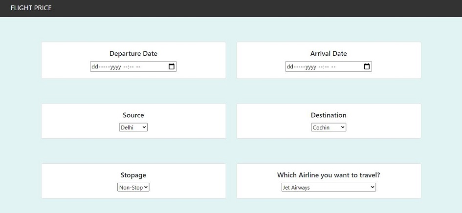
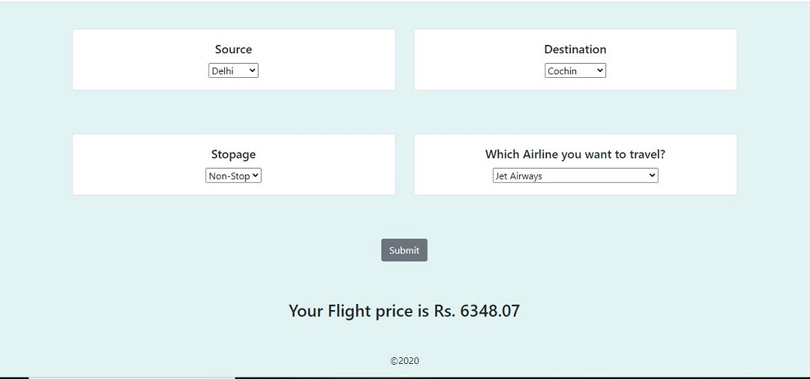

# Flight_price_prediction
<hr>
## Model Description
This is a Flask web app which predicts fare of Flight ticket.

## How Application looks like:



### Directory 
```
├── static 
│   ├── css
├── template
│   ├── home.html
├── Procfile
├── README.md
├── app.py
├── flight_price.ipynb
├── flight_rf.pkl
├── requirements.txt
```
